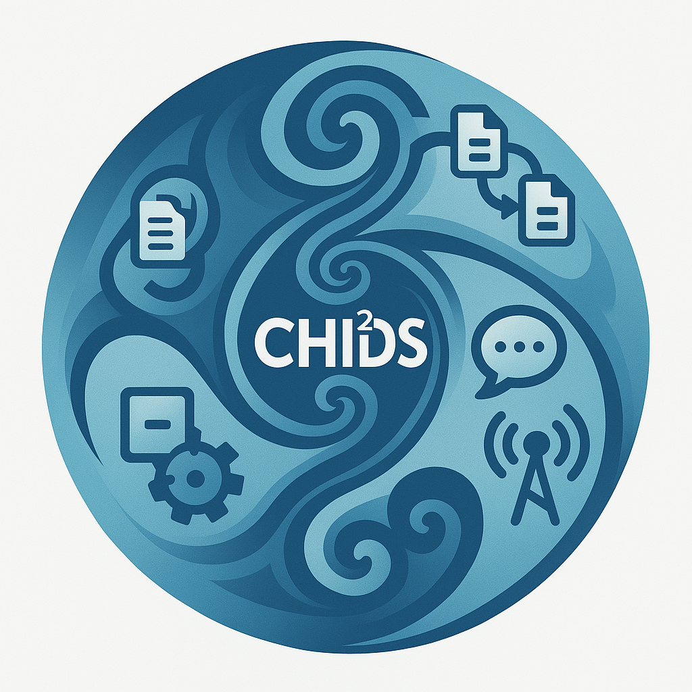
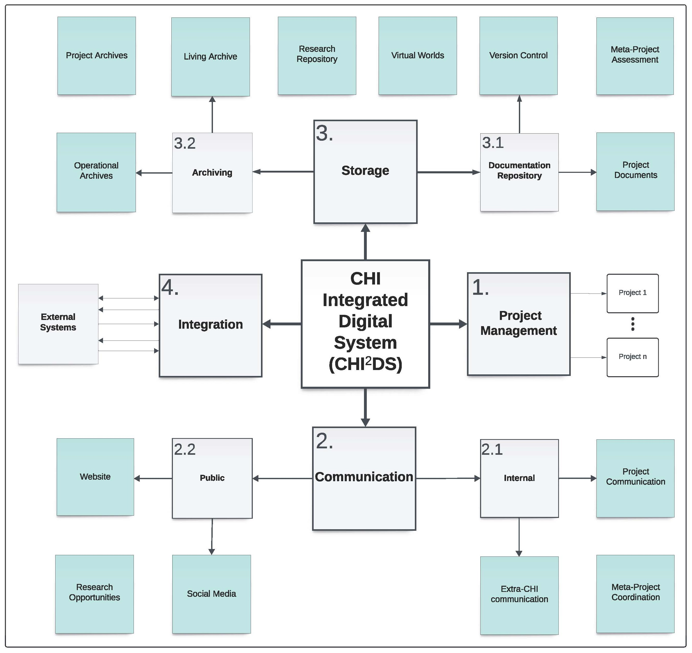

# CHIIDS: CHI Integrated Digital System



The digital nervous system for the Center for Holistic Integration (CHI) and its family of meta-projects (e.g., Balanced Blended Space (BBS), Blended Reality Performance System (BRPS), Collaborative AI (CAI)).

CHIIDS is a distributed, three-layer digital ecosystem designed to support the entire lifecycle of CHI's meta-projects: from theoretical proposal through active research to long-term archival.

**[Original Specification](project/architecture/chiids_original_spec.md)** | **[Repository Authority Model](project/AUTHORITY-MODEL.md)** | **[Developmental Roadmap](project/ROADMAP.md)** | **[Getting Started](#getting-started)**

---

## What is CHIIDS?

CHIIDS integrates research coordination, project management, collaborative AI workflows, and knowledge archiving across all CHI initiatives.

**Core Philosophy:** Integration over Creation — orchestrate existing systems rather than build redundant tools.

At its core, CHIIDS is organized around four cornerstones that reflect CHI’s mission and operating model: **Management**, **Communications**, **Storage**, and **Integration**. These work together to align projects with CHI’s goals, facilitate collaboration, preserve knowledge, and connect external systems without reinventing the wheel.

> CHIIDS supports participants’ original goals through thoughtful alignment with CHI meta-projects and initiatives. It preserves participating project integrity while seeking and exploiting synergies between these projects — optimizing existing tools for collaboration rather than reinventing systems.

**Philosophical Model:** CHIIDS embodies holistic integration—aligning voluntary partners, preserving each project's intent, and cultivating synergies instead of centralizing execution. We prefer integration over reinvention, maintain inclusivity across disciplines and resource levels, and use the system to safeguard integrity while enabling collaboration. For the full framing, see the [original specification](project/architecture/chiids_original_spec.md).

The system operates across four layers:

- **Layer 0 (Structural Framework)** — Schema, ontology, and organizational rules (this repository)
- **Layer 1 (Meta-Projects)** — Permanent projects conforming to Layer 0 structure
- **Layer 2 (Coordination)** — Semester-based research assignments and tracking
- **Layer 3 (Execution)** — Individual team repositories where work happens

See **[Part 1: Operational Management](docs/architecture/part_1_operational_management.md)** for the complete Layer 0 framework description.

---

## At a Glance

- Purpose: A unified system for coordinating CHI research, collaboration, and long-term knowledge stewardship.
- Audience: Faculty, researchers, students, and partners who want to understand CHI's meta-projects and how they connect.
- Authority: See the Repository Authority Model in [project/AUTHORITY-MODEL.md](project/AUTHORITY-MODEL.md) (canonical rules) or [docs/architecture/repository_structure.md](docs/architecture/repository_structure.md) (detailed guide).
- Foundations: The original engineering specification lives in [project/architecture/chiids_original_spec.md](project/architecture/chiids_original_spec.md) (also available as [PDF](project/architecture/chiids_original_spec_2024_09_21.pdf)).

## Cornerstones

### Management
- Plan and govern meta-projects and subprojects; assign tasks and track progress.
- Align voluntary partners’ goals with CHI initiatives while preserving project integrity.
- Maintain roadmaps, governance, and project relationships across the ecosystem.

### Communications
- Enable real-time collaboration and status flow across teams and semesters.
- Support public engagement with clear, accessible updates and summaries.
- Coordinate cross-team work without centralizing execution into a single repo.

### Storage
- Organize and secure documentation, deliverables, code, and media for long-term stewardship.
- Ensure versioning, retrieval, and archival across projects and publishing pipelines.
- Support both active work and preservation requirements.

### Integration
- Connect CHIIDS to external systems (GitHub, OpenLab, Zotero, WorldAnvil, City Tech platforms).
- Leverage existing tools to avoid redundancy; prioritize interoperability.
- Maintain smooth data and workflow interactions while protecting project integrity.

---

## Key Principles

CHIIDS is guided by CHI's core philosophy of _Holistic Integration_ and serves multiple meta-project frameworks (e.g., BBS, BRPS, CAI):

- **Scalability**: Accommodate growing participants, projects, and datasets
- **Interoperability**: Seamless integration with existing platforms; no redundant systems
- **User-Friendliness**: Accessible across academic and professional disciplines
- **Data Security & Privacy**: Strong protocols for integrity and confidentiality
- **Adaptability**: Flexible to support multiple interaction models
- **Task Automation**: Routine processes increase efficiency
- **Integration over Creation**: Orchestrate existing tools; focus on innovation

---

## Layer 0 Framework Examples

CHIIDS (this repository) defines the **structural framework** for organizing CHI meta-projects. Actual meta-projects (Layer 1) live in the **[CHI-CityTech organization](https://github.com/CHI-CityTech)**, where each follows the META-* Project Class pattern.

**Example Meta-Projects:**
- **Balanced Blended Space (BBS)** — Theory: Universal framework for combinative reality
- **Blended Reality Performance System (BRPS)** — Engineering: Modular test environment for BBS
- **Collaborative AI (CAI)** — AI/Human Collaboration: Partnership models for co-creation

*For the complete list of CHI meta-projects, see the [CHI-CityTech organization](https://github.com/CHI-CityTech).*

---

## How It Works

- Layers: CHIIDS spans four layers — Structural Framework (Layer 0), Meta-Projects (Layer 1), Coordination (Layer 2), and Execution (Layer 3).
- Governance: Layer 0 defines how projects, data, and collaboration are organized; Layers 1–3 apply those rules in practice.
- Principle: Integration over Creation — we connect existing tools to avoid redundancy and focus on meaningful outcomes.

## Scope

- Internal Coordination: The distributed three-layer system (Layers 1–3) organizes research, coordination, and execution across teams.
- Public Engagement: Websites, publications, citations, and storytelling (OpenLab/WordPress, OJS/Zenodo, Zotero, WorldAnvil) communicate CHI work outward.
- External Integration: CHIIDS connects to partner and institutional systems (GitHub, OpenLab, Zotero, WorldAnvil, City Tech platforms) to keep work interoperable.

## Where to Explore

- Meta-Projects: Browse the [CHI-CityTech organization](https://github.com/CHI-CityTech) to see active initiatives.
- Semester Coordination: Visit [StudentResearch](https://github.com/CHI-CityTech/StudentResearch) for current assignments and milestones.
- Architecture: Read the [Architecture Overview](docs/architecture/) and [Part 1: Operational Management](docs/architecture/part_1_operational_management.md).
- Roadmap & Terms: See [project/ROADMAP.md](project/ROADMAP.md) and [project/GLOSSARY.md](project/GLOSSARY.md).

---

## Repository Structure

```
META-CHIIDS/ (this repository)
│
├── README.md                          # Main entry point (you are here)
├── ABSTRACT.md                        # One-page abstract for citations
├── LICENSE                            # MIT License
│
├── docs/
│   ├── ARCHITECTURE.md                # Three-layer system design
│   ├── ECOSYSTEM.md                   # Current meta-projects
│   ├── GLOSSARY.md                    # Key definitions
│   ├── INTEGRATION-PATHS.md           # External system integration
│   └── WORLDANVIL-WORKFLOW.md         # World-building workflow
│
├── database/
│   ├── schema.sql                     # SQLite relational schema
│   ├── seed_data.sql                  # Initial meta-projects
│   └── migrations/
│       └── 001_initial_schema.sql
│
├── templates/
│   ├── PROJECT_PROPOSAL_TEMPLATE.md   # For new project proposals
│   └── PROJECT_CARD_TEMPLATE.md       # For StudentResearch cards
│
├── assets/
│   ├── ChatGPT_CHIIDS_Logo.png
│   └── CHIIDS_V1.jpg                  # System map
│
└── .github/
    └── workflows/
        └── build_meta_project_reports.yml
```

---

## System Components

### Layer 0: Structural Framework (Permanent)
**Location:** This repository  
**Contains:** Schema, ontology, META-* Project Class pattern, architectural documentation  
**Purpose:** Define the structure that all CHI projects conform to  
**Key:** Agnostic to specific project content; defines the organizational framework

### Layer 1: Meta-Projects (Permanent)
**Location:** [CHI-CityTech organization](https://github.com/CHI-CityTech)  
**Contains:** Project definitions, proposals, dependencies, roadmaps  
**Purpose:** Instantiate the Layer 0 structure with actual CHI initiatives  
**Key:** Each meta-project follows the META-* Project Class pattern

### Layer 2: Research Coordination (Semester-Updated)
**Location:** StudentResearch repository  
**Contains:** Project Cards, student assignments, team memberships, milestones  
**Purpose:** Connect meta-projects to semester work  
**Key:** Persistent but refreshed each term

### Layer 3: Execution (Distributed)
**Location:** Individual team repositories  
**Contains:** Code, assets, research logs, deliverables  
**Purpose:** Where actual research and development happens  
**Key:** Multiple repos, ongoing work

---

## System Integration

CHIIDS integrates with GitHub, StudentResearch, OpenLab, WorldAnvil, Zotero, and more — bringing existing platforms into one coherent workflow. See **[INTEGRATION-PATHS.md](docs/INTEGRATION-PATHS.md)** for details.

---

## Explore the System

- Interactive App: See the [frontend](frontend/README.md) for a modern React UI to browse projects and dependencies.
- Data Access: Use the local Datasette UI or API when developing; engineering details are documented under [docs/architecture/](docs/architecture/).
- Organization: Browse active meta-projects at the [CHI-CityTech organization](https://github.com/CHI-CityTech).

## Public Engagement

- Website: Public-facing content will be published via CHI’s OpenLab/WordPress site, coordinated from CHIIDS artifacts and status. See [OpenLab_Integration.md](OpenLab_Integration.md).
- Publications: CHI Publications (OJS) will provide peer-reviewed articles and proceedings; DOIs are managed via Zenodo with citation metadata synchronized.
- Citations: Zotero group libraries track references across meta-projects; bibliographies are exported per project and preserved alongside artifacts.
- World-Building: Public storytelling and engagement via WorldAnvil. See **[WORLDANVIL-WORKFLOW.md](docs/WORLDANVIL-WORKFLOW.md)**.

---

## The CHIIDS System Map



*Visual representation of the CHIIDS integrated system architecture and component relationships. This map mirrors the original specification’s quadrant diagram: CHIIDS at the center with Storage (top), Management (right), Communications (bottom), and Integration (left), each with their dependent categories.*

---

## License

MIT License. See [LICENSE](LICENSE) for details.

---

## For More Information

- **Authority Model:** See [project/AUTHORITY-MODEL.md](project/AUTHORITY-MODEL.md)
- **Original Specification:** [project/architecture/chiids_original_spec.md](project/architecture/chiids_original_spec.md) (also [PDF](project/architecture/chiids_original_spec_2024_09_21.pdf))
- **Architecture Overview:** [docs/architecture/](docs/architecture/)
- **Layer 0 Framework:** [Part 1: Operational Management](docs/architecture/part_1_operational_management.md)
- **Development Roadmap:** [project/ROADMAP.md](project/ROADMAP.md)
- **Key Terms:** [project/GLOSSARY.md](project/GLOSSARY.md)
- **External Integration:** [integration_paths.md](docs/reference/integration_paths.md)
- **World-Building:** [worldanvil_workflow.md](docs/reference/worldanvil_workflow.md)
- **META-* Templates:** [templates/meta_project_class/](templates/meta_project_class/)
- **Create a Proposal:** [PROJECT_PROPOSAL_TEMPLATE.md](templates/PROJECT_PROPOSAL_TEMPLATE.md)
- **Coordinate Research:** [PROJECT_CARD_TEMPLATE.md](templates/PROJECT_CARD_TEMPLATE.md)

**Questions?** Open an issue in this repository or contact CHI administration.

---

*CHIIDS: The digital backbone of the Balanced Blended Space framework at the Center for Holistic Integration.*
